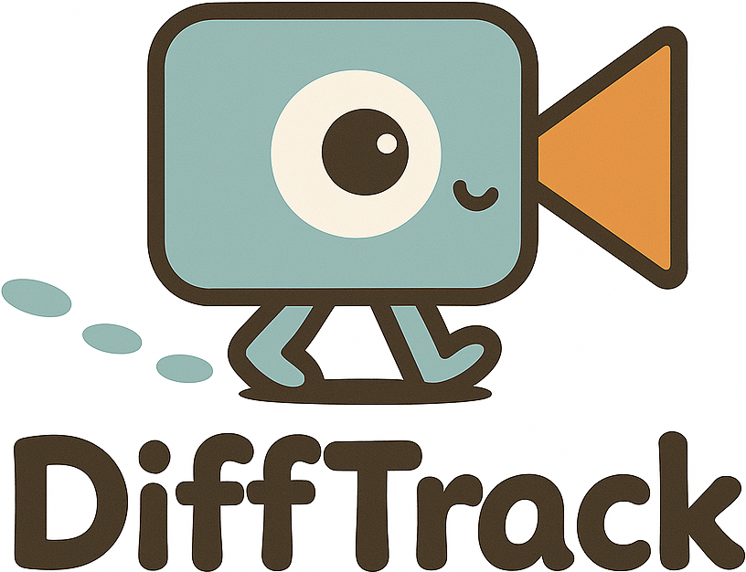

<div align="center">
<h1>

 Emergent Temporal Correspondences from Video Diffusion Transformers</h1>

[**Jisu Nam**](https://scholar.google.com/citations?hl=zh-CN&user=xakYe8MAAAAJ)<sup>*1</sup>, [**Soowon Son**](https://scholar.google.com/citations?hl=zh-CN&user=Eo87mRsAAAAJ)<sup>*1</sup>, [**Dahyun Chung**](https://scholar.google.com/citations?hl=ko&user=EU52riMAAAAJ)<sup>2</sup>, [**Jiyoung Kim**](https://scholar.google.co.kr/citations?hl=ko&user=DqG-ybIAAAAJ)<sup>1</sup>, [**Siyoon Jin**](https://scholar.google.com/citations?hl=zh-CN&user=rXRHxkwAAAAJ)<sup>1</sup>, [**Junhwa Hur**](https://scholar.google.com/citations?hl=zh-CN&user=z4dNJdkAAAAJ)<sup>&dagger;3</sup>, [**Seungryong Kim**](https://scholar.google.com/citations?hl=zh-CN&user=cIK1hS8AAAAJ)<sup>&dagger;1</sup>

<sup>1</sup>KAIST AI&emsp;&emsp;&emsp;&emsp;<sup>2</sup>Korea University&emsp;&emsp;&emsp;&emsp;<sup>3</sup>Google DeepMind


<sup>*</sup> Equal contribution. <sup>&dagger;</sup>Co-corresponding author.

<a href=""></a>
<a href='https://cvlab-kaist.github.io/DiffTrack/'></a>


</div>

### 🔍 How do Video Diffusion Transformers (Video DiTs) learn and represent temporal correspondences across frames?

To address this fundamental question, we present **DiffTrack** - a unified framework for uncovering and exploiting emergent temporal correspondences in video diffusion models. DiffTrack introduces:

**📽️ Synthetic Video Dataset** enriched with pseudo ground-truth point tracking annotations.

**📊 Novel Evaluation Metrics** specifically designed to quantify cross-frame consistency and attention-based correspondence.

**🚀 Two Practical Applications**
- **Zero-shot Point Tracking**  achieving state-of-the-art (SOTA) performance.
- **Motion-Enhanced Video Generation** via a novel Cross-Attention Guidance (CAG) technique.


## Installation

```bash
git clone https://github.com/cvlab-kaist//DiffTrack.git
cd DiffTrack

conda create -n diff-track python=3.10 -y
conda activate diff-track
pip install -r requirements.txt

cd diffusers
pip install -e .
```
</br>

# 1. Correspondence Analysis in Video DiTs

### Analysis on Generated Videos
We provide correspondence analysis across several video backbone models: CogVideoX-2B, CogVideoX-5B, HunyuanVideo, CogVideoX-2B-I2V, and CogVideoX-5B-I2V.

Additional analysis scripts are available in the `scripts/analysis` directory. 

```bash
model=cogvideox_t2v_2b
scene=fg
python analyze_generation.py \
    --output_dir ./output \
    --model $model --video_mode $scene --num_inference_steps 50 \
    --matching_accuracy --conf_attn_score \
    --vis_timesteps 49 --vis_layers 17 \
    --vis_attn_map --pos_h 16 24 --pos_w 16 36 --vis_track \
    --txt_path ./dataset/txt_prompts/$scene.txt \
    --idx_path ./dataset/$model/${scene}_50.txt \
    --track_dir ./dataset/$model/$scene/tracks \
    --visibility_dir ./dataset/$model/$scene/visibility \
    --device cuda:0
```

#### Key Options

- `--model`: Supported models include `cogvideox_t2v_2b`, `cogvideox_t2v_5b`, `cogvideox_i2v_2b`, `cogvideox_i2v_5b`, `hunyuan_t2v`.
- `--video_mode`: Set to `fg` for object-centric or `bg` for scenic videos.
- `--matching_accuracy`: Computes matching accuracy using both query-key and intermediate features.
- `--conf_attn_score`: Computes confidence score and attention score.
- `--vis_attn_map`: Aggregates cost maps for attention visualization.
- `--vis_track`: Visualizes trajectory using query-key descriptors.


*This script should reproduce videos in the `sample` directory.*

</br>

### Analysis on Real Videos (TAP-Vid-DAVIS)
We provide correspondence analysis across several video backbone models: CogVideoX-2B, CogVideoX-5B. 

Additional analysis scripts are available in the `scripts/analysis` directory. 

```bash
python analyze_real.py \
    --output_dir ./output \
    --model cogvideox_t2v_2b --num_inference_steps 50 \
    --matching_accuracy --confidence_attention_score \
    --resize_h 480 --resize_w 720 \
    --eval_dataset davis_first --tapvid_root /path/to/data \
    --device cuda:0
```
</br>


# 2. Zero-Shot Point Tracking

### Download Evaluation Dataset

```bash
wget https://storage.googleapis.com/dm-tapnet/tapvid_davis.zip
unzip tapvid_davis.zip
```

For TAP-Vid-Kinetics, please refer to the [TAP-Vid GitHub](https://github.com/google-deepmind/tapnet/tree/main/tapnet/tapvid).


### Run Evaluation
We provide across several video backbone models: CogVideoX-2B, CogVideoX-5B, HunyuanVideo.

Additional evaluation scripts are available in the `scripts/point_tracking` directory.

```bash
model=cogvideox_t2v_2b
python evaluate_tapvid.py \
    --model $model \
    --matching_layer 17 --matching_timestep 49 --inverse_step 49 \
    --output_dir ./output \
    --eval_dataset davis_first --tapvid_root /path/to/data \
    --resize_h 480 --resize_w 720 \
    --chunk_frame_interval --average_overlapped_corr \
    --vis_video --tracks_leave_trace 15 \
    --pipe_device cuda:0
```

#### Chunking Options

- `--chunk_len`: Number of frames per chunk. (default: `13`)
- `--chunk_frame_interval`: Interleave frames to reduce temporal gap.
- `--chunk_stride`: Stride for sliding window. (default: `1`)
- `--average_overlapped_corr`: Average overlapping correlation maps.

#### Cost Map Aggregation

- `--matching_layer`: Transformer layers for descriptor extraction. (e.g., `17` for cogvideox_t2v_2b).
- `--matching_timestep`: Denoising timesteps for descriptor extraction. (e.g., `49` for cogvideox_t2v_2b).

#### Dataset Options

- `--tapvid_root`: Path to TAP-Vid dataset.
- `--eval_dataset`: Choose from `davis_first` and `kinetics_first`
- `--resize_h` / `--resize_w`: Resize video resolution.
- `--video_max_len`: Max length of input video.
- `--do_inversion` / `--add_noise`: Modify inversion strategy.

#### Visualization Options

- `--vis_video`: Visualize trajectories on video.
- `--tracks_leave_trace`: Number of frames for trajectory trail.


</br>


# 3. Cross Attention Guidance (CAG)

We provide across several video backbone models: CogVideoX-2B, CogVideoX-5B.

Additional motion guidance scripts are available in the `scripts/motion_guidance` directory.

```bash
CUDA_VISIBLE_DEVICES=0 python motion_guidance.py \
    --output_dir ./output \
    --model_version 2b \
    --txt_path ./dataset/txt_prompts/cag_prompts.txt \
    --pag_layers 13 17 21 \
    --pag_scale 1 \ 
    --cfg_scale 6
```
#### Key Options
- `--model_version`: Supported cogvideox models include `2b`, `5b`.
- `--pag_layers`: Layers where CAG is applied (e.g., `[13, 17, 21]` for 2B, `[15, 17, 18]` for 5B).
- `--pag_scale`: Cross attention guidance scale (default: `1.0`).
- `--cfg_scale`: Classifier-Free Guidance scale (default: `6.0`).


### Citing this Work
Please use the following bibtex to cite our work:
```

```